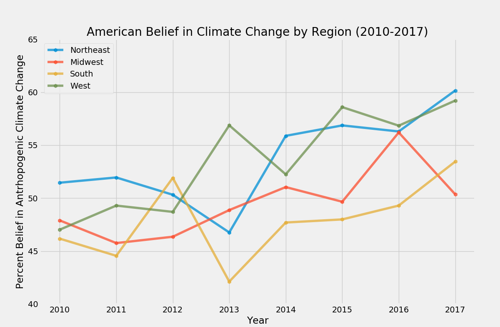

# Who Cares About Climate Change? (2010-2017)
To better understand Americans’ views on climate change, the [Yale Program on Climate Change Communication (YPCCC)](http://climatecommunication.yale.edu/) and the [George Mason University Center for Climate Change Communication (Mason 4C)](http://www.climatechangecommunication.org/) have conducted nationally representative surveys of U.S. adults twice a year for the past decade. 

## The Data
Surveys were administered twice a year in 'waves' from 2010-2017 (appproximately 2-3k responses per year). They were also administered in 2008, but not in 2009, 
so to avoid making assumptions about a gap in the data, I just cut that year out. That leaves us with:

**52 columns, 17,860 points:**
    - 3 metadata columns
    - 2 weighting columns
    - 18 opinion questions, bucketed
    - 29 demographical questions, bucketed


```
      happening  cause_original cause_other_text  cause_recoded  sci_consensus
2169        3.0             2.0                             4.0            2.0
2170        3.0             2.0                             4.0            2.0
2171        3.0             1.0                             6.0            1.0
2172        1.0             2.0                             4.0            2.0
2173        3.0             2.0                             4.0            1.0
```


*Who knew science could be so poetic?*
```
In [11]: df.iloc[1364, 7]                                                                                                                                                                     
Out[11]: 'with the world so hate mongered the lord will soon comr to take us home'
```

**Weighting** 
Designed to make samples better reflect census data based on age, gender, race, region, metropolitan status, education, and income.
```
     case_ID  wave  year  weight_wave  weight_aggregate  happening
433    473.0   1.0   1.0         3.94          2.144573        2.0
434    474.0   1.0   1.0         0.55          0.299369        3.0
435    475.0   1.0   1.0         0.38          0.206837        3.0
436    476.0   1.0   1.0         0.78          0.424560        1.0
437    477.0   1.0   1.0         0.41          0.223166        2.0
```

## The Question
More than just *who* cares about climate change, I wanted to look at who *started* caring about climate change. Why the change of heart? Finding patterns in these 'conversions' could give us insight into why people believe what they do, and what factors impact change. But the first questions to ask is--'who?' Specifically, which groups had the greatest difference in responding to one question over 7 years--'Assuming global warming is happening, do you think it is...'. Participants could then choose from 4 responses ranging from 'caused mostly by human activity' to 'none of the above because global warming isn’t happening'.

**Regional Analysis**
To kick off my EDA, I wanted to see if there were any trends geographically. 
*refer to Code*
My strategy for visualizing how sentiments in each of the 4 US regions (Northeast, Midwest, South, West) changed over time was to:
** **
1. Create a new dataframe with only columns relevant to calculating what percent of the population each year said they thought global warming was happening and that it is mostly caused by humans. 

2. Create an empty numpy array with the same number of rows as regions (4) and columns as years (8).

3. Iterate through each of the 4 regions, aggregating a new dataframe that has two columns that are then summed while grouping by year--the number of participants who responded that humans are warming the earth (weighted), and the number of people who responded from that region total during that year, and using these to make a third column of what percent of that region's population were 'believers'. 

4. Each iteration, a region's historical belief stats are fed into a line of the empty numpy array, until we have a ready-to-plot matrix!



**Demographic Analysis**

Okay. But there are so many groups in this study. How do we capture the most significant shifts in sentiment? But what if we could compare the changes in all the groups labeled by this study, not just the subgroups of one category?
*refer to Code*

Essentially I took the fundamental concept of my regional EDA (separating demographics into their own weighted columns, aggregating, and making a new structure to plot), and used for loops to scale it up to any list of categories (columns) and the bucketed responses (demographics) that fall under each. Also, since there are so many demographics to look at, the best visualization would be a (large) bar chart illustrating each demographics maximum change ('max delta') over the survey period. In other words, what is the difference between the group's lowest and highest belief rate?
** **
1. Since none of the names of subcategories under each column are included in the csv, I had to start out by listing the columns whose demographics I was interested in aggregating, then making a list of lists whose index matched up with that of the columns list. 

2. Super-efficient double for loop to iterate through columns, adding each sub-category as a new column in the dataframe, with 1's indicating which individuals belong to that group, and zeroes for everyone else. 

3. Lots of passing values in and out of functions, odd string functions to make new lists of columns.  

4. Once all new columns are made for all demographics, we aggreagte and summ again, and pass values into another matrix. 

5. Find the minimum and maximum of each aggregated demographic column, and find the difference. I realize this does not account for instances where more people in a group actually start to belive less in climate chaneg over time. Ran out of time playing with if statements and indices. 

6. Create a df with a demographics column, listing max delta for each. 

7. Sort and plot!


## Future steps?
- Argument parsing ?
- Dynamic variables--income, education?
- Hypothesis testing: what variables across all demogrphics are most closely liked to high max deltas?


